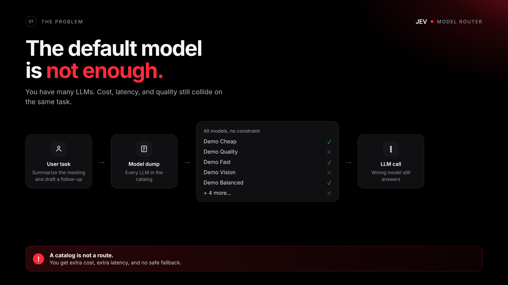
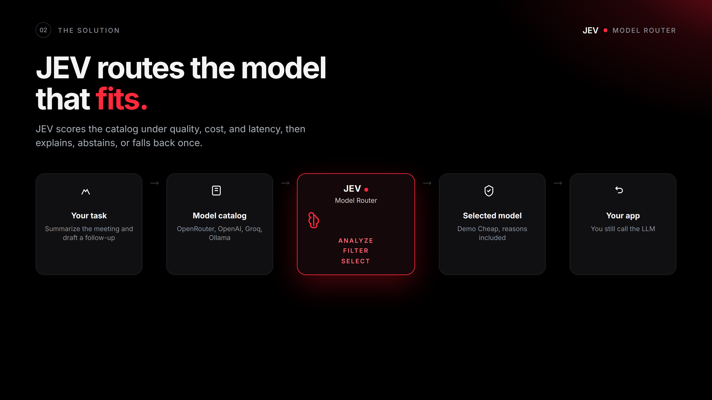
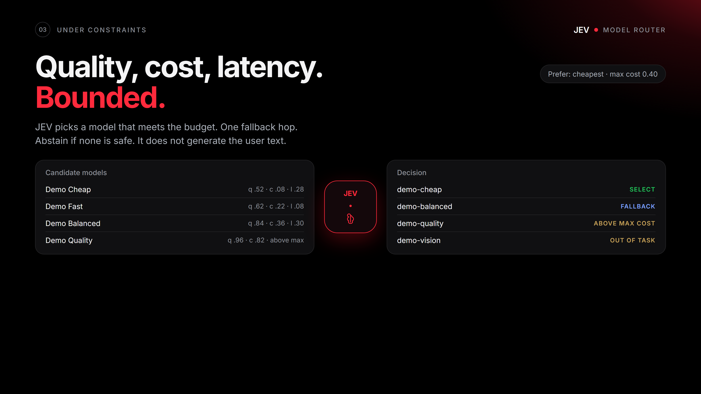
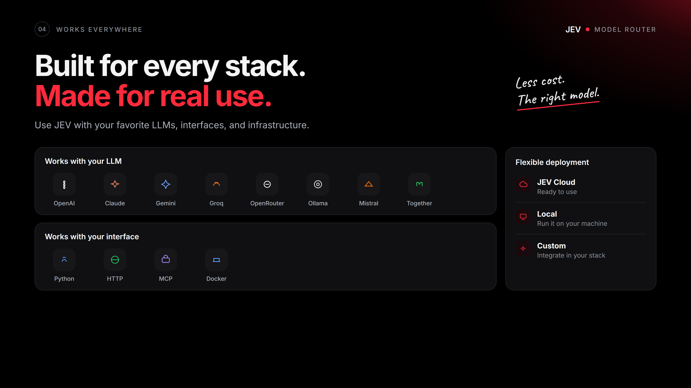

# jev-model-router

Routes an LLM under quality, cost, and latency constraints.

Author: [Pinuts](https://github.com/Pinutss). MIT license.

Part of [JEV Labs](https://github.com/Pinutss/jev-labs).

Stack: Python 3.10+, HTTP, MCP stdio, Docker, HTML demo.

After `jev-model serve`: [demo](http://127.0.0.1:8080/)

<p>
  
  
</p>
<p>
  
  
</p>

## Local, no keys

```bash
git clone https://github.com/Pinutss/jev-model-router
cd jev-model-router
uv sync
uv run jev-model demo
uv run jev-model serve
```

No agent and no LLM are required. `JEV_PROVIDER=auto` (the default) stays on the local heuristic. If JEV and a gateway are configured, they are used as the judge. Docker:

```bash
docker compose up
```

## What the prototype does

The router chooses a model from a catalog (OpenRouter, OpenAI, Groq, Together, Fireworks, Mistral, Ollama, or a JSON file). It explains the choice, abstains if no candidate is safe, and allows only one fallback hop.

It does not call the LLM to generate user text, except the optional JEV judge when `provider=jev`. Local ranking is deterministic.

Capabilities come only from the catalog and the caller constraints. The task cannot add them. Keys stay in the environment: never in the HTTP or MCP body, never in the response.

If you pass `models` to `route()`, that list is the only catalog used. If you omit it, the public multi-LLM catalog is merged with the demo models.

## Multi-LLM catalog

`load_catalog()` merges presets, `JEV_MODELS_FILE`, and `JEV_LLM_<NAME>_*` overlays. `GET /v1/llms` and `jev-model llms` expose the public catalog (`has_key`, never the raw key).

```bash
uv run jev-model llms
```

## Hermes and OpenClaw

Yes, locally. The MCP process does not need JEV or a gateway:

```bash
uv run jev-model mcp
```

One tool: `model_route`. Pass `task` and optionally `models`. Keys stay in the process environment, not in the call.

**Hermes** (`~/.hermes/config.yaml`):

```yaml
mcp_servers:
  jev-model:
    command: uv
    args: ["run", "--directory", "/path/to/jev-model-router", "jev-model", "mcp"]
    env:
      JEV_PROVIDER: local
```

**OpenClaw** (`~/.openclaw/openclaw.json`, or Settings > MCP > Stdio):

```json
{
  "mcp": {
    "servers": {
      "jev-model": {
        "command": "uv",
        "args": ["run", "--directory", "/path/to/jev-model-router", "jev-model", "mcp"],
        "env": { "JEV_PROVIDER": "local" }
      }
    }
  }
}
```

## Python

```python
from jev_model_router import ModelRouter, DEFAULT_MODELS

result = ModelRouter(provider="local").route(
    task="Summarize this meeting and draft a follow-up email",
    models=DEFAULT_MODELS,
    prefer="balanced",
    scope="demo",
)
print(result.decision, result.selected.id if result.selected else result.abstain_reason)
```

## JEV + gateway (optional)

If you wire the cloud later, two keys are enough: `JEV_API_KEY` / `JEV_BASE_URL`, and your gateway. If `GATEWAY_*` is incomplete, the multi-LLM catalog resolves the judge (`OPENROUTER_API_KEY`, `OPENAI_API_KEY`, and similar).

No key in the HTTP or MCP body.

```bash
cp .env.example .env
```

`JEV_PROVIDER=jev` will not start if JEV or the resolved gateway is missing. With `auto`, missing keys just keep the local heuristic. A model without a resolvable key is rejected (`missing_key`), except Ollama.

## HTTP

```bash
uv run jev-model serve
```

`GET /`, `/demo`, `/healthz`, `/v1/llms`. `POST /v1/route`. Binds `127.0.0.1`. The body must not contain keys.

## Local validation

```bash
uv run jev-model benchmark
```

Annotated set in `benchmarks/annotated_tasks.json`. This is a local baseline, not a live JEV trial.

## Limits

Local ranking is deterministic (quality, cost, latency, plus a lexical bonus). Scope isolates lists, it is not auth. One fallback hop. No user-text generation. No store, no PyPI yet.

`docs/vision.md` is a long-term target, not the current contract.
